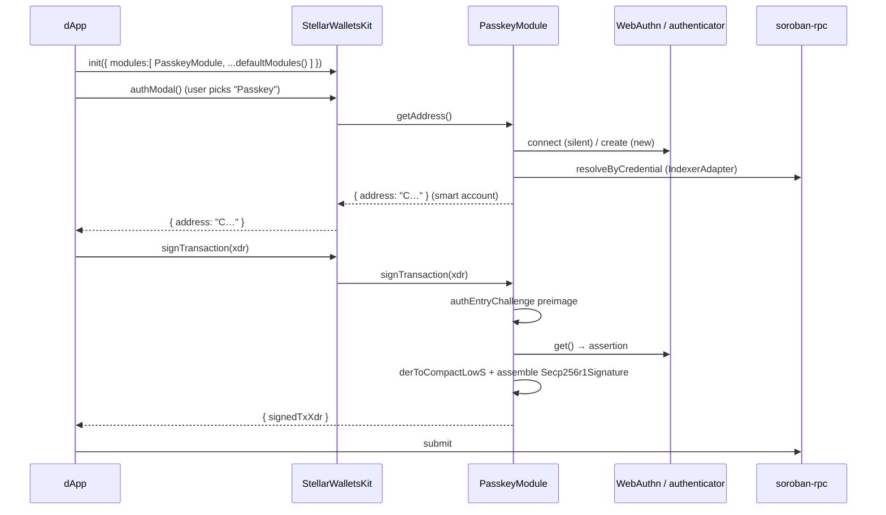

`@stellar-passkey` ships a [`PasskeyModule`](/passkey-module) that plugs into
[`@creit.tech/stellar-wallets-kit`](https://github.com/Creit-Tech/Stellar-Wallets-Kit)
(studied against **v2.2.0**). Once registered, a passkey smart account behaves
like any other wallet in the kit: it appears in the wallet-picker modal, and
`getAddress` / `signTransaction` / `signAuthEntry` delegate to it. No bespoke
WebAuthn plumbing in your app — the module is a thin adapter over
[`@stellar-passkey/core`](/sdk/overview).

<Note>
  The goal is for `PasskeyModule` to ship **inside** the kit (upstream PR, S27),
  imported from a kit subpath like the kit's other modules. This guide **leads
  with that post-merge usage**, then documents the current pre-merge staged
  package so you can integrate today.
</Note>

## How it fits together

<CardGroup cols={2}>
  <Card title="PasskeyModule reference" icon="puzzle-piece" href="/passkey-module">
    The `ModuleInterface` mapping and every `PasskeyModuleOptions` field.
  </Card>
  <Card title="SDK overview" icon="cube" href="/sdk/overview">
    The ceremonies and crypto the module wraps — create, connect, sign, recover.
  </Card>
</CardGroup>



## Integrate (post-merge, in-kit)

<Steps>
  <Step title="Install the kit">
    The passkey module ships inside the kit, so you only add the kit itself plus
    the Stellar SDK peer dependency the passkey crypto needs.

    ```bash
    pnpm add @creit.tech/stellar-wallets-kit @stellar/stellar-sdk
    ```
  </Step>

  <Step title="Register PasskeyModule alongside the default modules">
    `PasskeyModule` needs an [`IndexerAdapter`](/sdk/adapters) (to resolve a
    credential to its smart-account `C…` address) and an `AccountDeployer` (your
    factory call that deploys a new smart account on create). The zero-infra
    `eventsIndexer` covers the indexer with no extra services.

    ```ts
    import { StellarWalletsKit } from '@creit.tech/stellar-wallets-kit/sdk';
    import { defaultModules } from '@creit.tech/stellar-wallets-kit/modules/utils';
    import { PasskeyModule, PASSKEY_ID } from '@creit.tech/stellar-wallets-kit/modules/passkey';
    import { eventsIndexer } from '@stellar-passkey/core';
    import { Networks } from '@stellar/stellar-sdk';

    const rpcUrl = 'https://soroban-testnet.stellar.org';
    const networkPassphrase = Networks.TESTNET;

    const indexer = eventsIndexer({ rpcUrl, factoryContractId: 'C…FACTORY' });

    StellarWalletsKit.init({
      network: 'TESTNET',
      modules: [
        new PasskeyModule({
          rpId: 'wallet.example.com',
          rpName: 'Example Wallet',
          networkPassphrase,
          indexer,
          deployer: myFactoryDeployer, // your AccountDeployer — see SDK › create
        }),
        ...defaultModules(),
      ],
    });
    ```

    <Note>
      `StellarWalletsKit` exposes **static** methods in v2.2.0 — you call
      `StellarWalletsKit.init(...)`, not `new StellarWalletsKit(...)`. The exact
      npm scope (`@creit.tech` vs the jsr `@creit-tech`) and the
      `/modules/passkey` subpath are finalized in the upstream PR (S27).
    </Note>
  </Step>

  <Step title="Let the user pick a wallet">
    Open the kit's own wallet-picker modal. The user selects **“Passkey”**, the
    OS passkey sheet appears (create-or-connect), and the kit resolves the
    smart-account address.

    ```ts
    const { address } = await StellarWalletsKit.authModal();
    // address is a Soroban smart-account C… address — see the warning below.

    // Or select it programmatically (e.g. a dedicated "Sign in with Passkey" button):
    StellarWalletsKit.setWallet(PASSKEY_ID); // PASSKEY_ID === 'passkey'
    const { address: a2 } = await StellarWalletsKit.getAddress();
    ```
  </Step>

  <Step title="Sign through the kit">
    Build and simulate your Soroban invocation, then sign it through the kit. The
    call delegates to `PasskeyModule.signTransaction`, which signs every
    address-credential auth entry via `@stellar-passkey/core` — ES256, low-S
    normalized, bound to the transaction.

    ```ts
    const { signedTxXdr } = await StellarWalletsKit.signTransaction(preparedTxXdr, {
      networkPassphrase: Networks.TESTNET,
      address, // the connected C-address
    });
    // submit signedTxXdr via soroban-rpc (or a SubmissionAdapter).

    // To sign a single bare auth entry instead:
    const { signedAuthEntry } = await StellarWalletsKit.signAuthEntry(entryXdr, {
      networkPassphrase: Networks.TESTNET,
    });
    ```
  </Step>
</Steps>

<Warning>
  **`getAddress` returns a `C…` contract address, not a classic `G…` account.**
  A passkey wallet is a Soroban **smart account**, and the kit's `getAddress`
  returns an opaque address string with no `G`/`C` type signal. Downstream code
  that assumes a classic account — calling Horizon `accounts/{id}`, building
  classic payment ops — will mishandle it. Use the **Soroban path**: build
  `InvokeHostFunction` operations, authorize them via `signAuthEntry` /
  `signTransaction`, and submit through soroban-rpc. This C-address reconciliation
  is the single most important integration note (and the headline open question
  for upstream Issue #90).
</Warning>

## Creating a new account

`authModal()` / `getAddress()` resolves an **existing** account (silent
`connect`). For a brand-new user with no passkey yet, drive the create ceremony
explicitly — either with the [styled Create screen](/components/create) or by
calling the module's `createAccount` helper (a convenience beyond the
`ModuleInterface`):

```ts
StellarWalletsKit.setWallet(PASSKEY_ID);
const passkeyModule = StellarWalletsKit.selectedModule as PasskeyModule;

// Must run inside a click handler — WebAuthn requires a user gesture.
const credential = await passkeyModule.createAccount('alice');
// → { contractId: 'C…', credentialId, publicKey }
```

<Tip>
  For polished create / sign / recover flows that already handle the OS-sheet
  states, errors, and accessibility, drop in the
  [styled components](/components/overview). They wrap the same SDK calls and
  re-theme from CSS tokens to match your brand.
</Tip>

## Pre-merge (staged package) usage

Until the upstream PR lands, the module is published from a staged package and
registered the same way. Only the **import lines** differ — the registration,
modal, and signing calls are identical.

<Tabs>
  <Tab title="Post-merge (in-kit)">
    ```ts
    import { StellarWalletsKit } from '@creit.tech/stellar-wallets-kit/sdk';
    import { defaultModules } from '@creit.tech/stellar-wallets-kit/modules/utils';
    import { PasskeyModule, PASSKEY_ID } from '@creit.tech/stellar-wallets-kit/modules/passkey';

    StellarWalletsKit.init({
      modules: [
        new PasskeyModule({ rpId, rpName, networkPassphrase, indexer, deployer }),
        ...defaultModules(),
      ],
    });
    StellarWalletsKit.setWallet(PASSKEY_ID);
    ```
  </Tab>
  <Tab title="Pre-merge (staged package)">
    ```ts
    import { StellarWalletsKit } from '@creit.tech/stellar-wallets-kit/sdk';
    import { defaultModules } from '@creit.tech/stellar-wallets-kit/modules/utils';
    // The module is imported from the staged adapter package instead of a kit subpath:
    import { PasskeyModule, PASSKEY_ID } from '@stellar-passkey/wallets-kit-module';

    StellarWalletsKit.init({
      modules: [
        new PasskeyModule({ rpId, rpName, networkPassphrase, indexer, deployer }),
        ...defaultModules(),
      ],
    });
    StellarWalletsKit.setWallet(PASSKEY_ID);
    ```
  </Tab>
</Tabs>

<Note>
  `@stellar-passkey/wallets-kit-module` is a **private, staged** package — it is
  upstreamed via PR (S27), not published as a parallel npm dependency. When the
  module lands inside the kit, the only change in your app is the single import
  line for `PasskeyModule`; the kit's `ModuleInterface` it implements is
  unchanged.
</Note>

## What the kit delegates to the module

Every kit-level call routes to the selected `PasskeyModule`:

| Kit call | Delegates to `PasskeyModule` | Result |
| --- | --- | --- |
| `StellarWalletsKit.authModal()` | `isAvailable()` (picker) → `getAddress()` | `{ address }` (smart-account `C…`) |
| `StellarWalletsKit.getAddress()` | cached `getAddress()` | `{ address }` |
| `StellarWalletsKit.signTransaction(xdr, opts)` | `signTransaction` → core `signTransaction` | `{ signedTxXdr, signerAddress? }` |
| `StellarWalletsKit.signAuthEntry(entry, opts)` | `signAuthEntry` → core `signAuthEntry` | `{ signedAuthEntry, signerAddress? }` |
| `StellarWalletsKit.signMessage(msg, opts)` | `signMessage` (app-defined semantics) | `{ signedMessage, signerAddress? }` |
| `StellarWalletsKit.getNetwork()` | `getNetwork()` | `{ network, networkPassphrase }` |

The module's signatures align with **SEP-43** (`signTransaction` /
`signAuthEntry` / `signMessage`), which is exactly what the SDK's Soroban auth
assembly produces. See the full mapping in the
[PasskeyModule reference](/passkey-module).

## Gotchas to confirm before production

<AccordionGroup>
  <Accordion title="C-address reconciliation (most important)">
    The kit core is address-string-agnostic, so a `C…` address flows through
    fine. The risk is **downstream dApp code** that assumes a classic `G…`
    account. Route passkey accounts through the Soroban path (InvokeHostFunction +
    `signAuthEntry`). A typed signal for contract accounts is an open question for
    the kit maintainers (Issue #90).
  </Accordion>
  <Accordion title="Simulation under-budgets __check_auth">
    `simulateTransaction` does **not** execute `secp256r1_verify`, so it
    under-budgets the on-chain `__check_auth`. Inflate the Soroban instruction
    budget and resource fee before submitting (or use a managed submitter), or the
    real transaction will run out of resources.
  </Accordion>
  <Accordion title="Signature wire shape is contract-specific">
    The SDK assembles a single-signer `Secp256r1Signature` struct
    `{ authenticator_data, client_data_json, signature }`. Multi-signer smart
    accounts (OZ / kalepail) key signatures by signer id in a `Map`, which needs a
    small per-contract wrapper around the assembled entry. The single-signer round
    trip is proven on testnet; verify your contract's expected shape.
  </Accordion>
  <Accordion title="signMessage has no on-chain verification standard">
    `signMessage` returns the low-S WebAuthn assertion signature (base64url).
    Smart accounts have no standardized on-chain message-verification scheme, so
    verifying it is application-defined for now.
  </Accordion>
</AccordionGroup>

<Card title="Next: the ModuleInterface mapping" icon="arrow-right" href="/passkey-module">
  See exactly how each `ModuleInterface` member maps to `@stellar-passkey/core`,
  plus every `PasskeyModuleOptions` field.
</Card>
