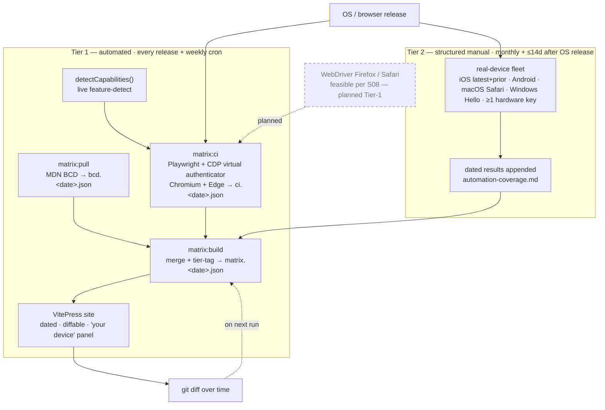

# Living compatibility-matrix — CI architecture

The matrix is **sourced and machine-verified**, not hand-maintained. Two tiers
feed one dated, diffable artifact. Every solid node below maps to a real script
or committed file (see the table) — there are no aspirational boxes; the only
dashed node is an explicitly-planned expansion.

## How this stays fresh

Tier-1 runs on **every release and a weekly cron**: `matrix:pull` re-ingests
MDN BCD, `matrix:ci` re-verifies Chromium + Edge by driving real
`create()`→`get()` ceremonies against CDP virtual authenticators (each signature
checked with `p256.verify`), and `matrix:build` merges them into a new dated
snapshot that the site renders and git diffs over time. Tier-2 covers what
machines can't: a real-device fleet (latest + prior iOS/Android, macOS Safari,
Windows Hello, ≥1 hardware key) re-checked **monthly and within 14 days of a
major OS/browser release**, with dated results appended to the coverage doc.
**Honest limits:** virtual authenticators don't reproduce biometrics, the Apple
Secure Enclave, the real ~50% high-S signature distribution, or in-app WebView
breakage — and Firefox/WebKit automation (feasible via WebDriver per S08) is
**not yet wired**, so those stay Tier-2 manual until the geckodriver/safaridriver
harness lands.

## Node → implementation (no aspirational boxes)

| Diagram node               | Built in  | Artifact                                                                  |
| -------------------------- | --------- | ------------------------------------------------------------------------- |
| `matrix:pull` (MDN BCD)    | S05       | `apps/matrix/scripts/pull-bcd.ts` → `data/bcd.*.json`                     |
| `detectCapabilities()`     | S06       | `apps/matrix/src/featureDetect.ts`                                        |
| `matrix:ci` (CDP CI)       | S07       | `apps/matrix/ci/run-matrix-ci.ts` → `data/ci.*.json` + GH `matrix-ci` job |
| `matrix:build` (merge)     | S09       | `apps/matrix/scripts/build-matrix.ts` → `data/matrix.*.json`              |
| VitePress site             | S09       | `apps/matrix/site/**` (`pnpm -F matrix build`)                            |
| Tier-2 fleet + coverage    | S08       | `docs/matrix/automation-coverage.md` + `src/tiers.ts`                     |
| _WebDriver Firefox/Safari_ | _planned_ | _feasible per S08; harness not yet wired (dashed)_                        |
